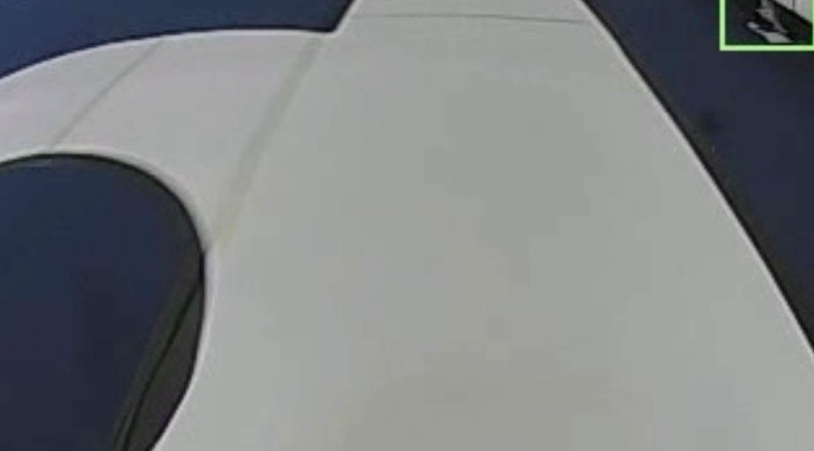

~~~C
void adaptiveThreshold(uint8_t* img_data, uint8_t* output_data, int width, int height, int block, uint8_t clip_value){
  assert(block % 2 == 1); // block必须为奇数
  int half_block = block / 2;
  for(int y=half_block; y<height-half_block; y++){
    for(int x=half_block; x<width-half_block; x++){
      // 计算局部阈值
      int thres = 0;
      for(int dy=-half_block; dy<=half_block; dy++){
        for(int dx=-half_block; dx<=half_block; dx++){
          thres += img_data[(x+dx)+(y+dy)*width];
        }
      }
      thres = thres / (block * block) - clip_value;
      // 进行二值化
      output_data[x+y*width] = img_data[x+y*width]>thres ? 255 : 0;
    }
  }
}

~~~

一侧全是直道：
    1. 直道
    2. 半边圆环
    根据另一侧是否含有突变确定是否是半边圆环
        两侧直道：直道
        一侧直道：圆环

